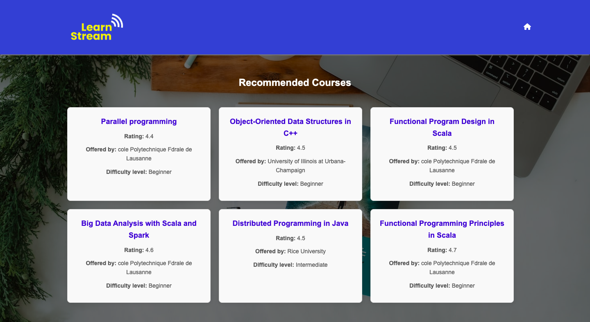

<h1 align="center">
        
</h1>

<div align="center">

[](https://www.kaggle.com/code/bushraqurban/coursera-course-recommender-system?scriptVersionId=219326674)
[](https://mechanical-oralia-bushra-e3bf072d.koyeb.app/)
[](https://scrutinizer-ci.com/g/bushraqurban/LearnStream)

</div>


*The main homepage where users can choose a course.*


*The recommendation page showing course suggestions based on the user input.*


## Objective 

The **LearnStream** website is designed to help users find Coursera courses tailored to their interests and learning goals. Key features include:

- **Personalized Course Recommendations**: Based on user input, the website provides course suggestions that match the entered course name.
- **User-Friendly Interface**: The website offers a simple and intuitive interface that allows users to easily explore courses and get relevant suggestions.
- **Responsive**: The website’s layout and components automatically adjust to the user’s device screen size.


## Setup and Installation 

Follow these steps to get your local environment up and running:

1.  **Clone the repository:**

```bash
git clone https://github.com/yourusername/LearnStream.git
cd LearnStream
```

2.  **Create and activate a virtual environment (optional but recommended):**
    
    On **Mac/Linux**:
    
    ```bash
    python3 -m venv venv
    source venv/bin/activate
    ```
    
    On **Windows**:
    
    ```bash
    python -m venv venv
    .\venv\Scripts\activate    
    ```
    
3.  **Install the required dependencies:**
    
```bash
pip install -r requirements.txt
```

4.  **Run the Flask application:**

```bash
python3 app.py # On Mac/Linux
python app.py # On Windowns
```

After running the application, visit `http://127.0.0.1:5000/` in your browser to view the app.


## How It Works 

1.  **Input**: Users can select a course from a dropdown menu, which is dynamically populated with course names.
2.  **Processing**: Once a course is selected, the website processes the request and uses the backend to find and recommend similar courses.
3.  **Output**: The app displays recommended courses links along with details like ratings, institutions, and difficulty levels.


## Folder Structure 

```plaintext
LearnStream/
│
├── app.py               # Flask application (backend logic)
├── templates/           # HTML templates
│   ├── index.html       # Home page template
│   └── recommendations.html  # Recommendations page template
├── static/              # Static files (CSS, images, etc.)
│   ├── css/
│   │   └── styles.css   # Styling for the web pages
│   └── images/
├── models/              # Pretrained models for recommendation
│   ├── similarity_matrix.pkl  # Precomputed similarity matrix
├── notebooks/           # Jupyter notebooks
│   └── model_training.ipynb  # Notebook for training model
├── data/                # Raw data files
│   └── coursera.csv     # Course data containing course details
├── data_loader.py       # Loads the course data and similarity matrix
├── helper.py            # Contains helper functions for data preprocessing and recommendations
├── requirements.txt     # List of required dependencies
└── README.md            # Project documentation
```


## Technologies Used 

-   **Python**: The core programming language for backend logic.
-   **Flask**: For building the backend web application.
-   **HTML5 & CSS3**: For structuring and styling the web pages.
-   **Jinja2**: For rendering dynamic HTML templates.


## License 

This project is licensed under the MIT License. See the LICENSE file for more details.
